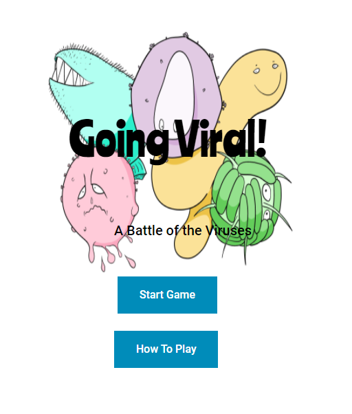

[](https://www.travis-ci.com/AhmedAlzubairi1/GoingViral)
[](https://biobus-goingviral.readthedocs-hosted.com/en/latest/?badge=latest)
# GoingViral
This is the repo of Biobus's Going Viral web based game. Players would get to pick viruses and compete to see which one can reach past stage 5 first using cards that simulate their behavior.



## Installation

```
pip install -r requirements.txt
```

## Running the Game

To run the sample terminal front end of the game do : 

```
cd Flask_Project
python3 server.py
```
Then go to http://127.0.0.1:5000/ on your browser

## Live Website
To interact with the deployed public website, go to this link:
https://goingviralapp.herokuapp.com/


Run the following to see the bug reports. Check the cleaned_bug_checker_report directory for the reports

```
./create_bug_report.sh
```

Run the following to see the check style reports. Check the cleaned_style_checker_report directory for the reports

```
./create_style_checker_report.sh
```


Run the testing suite with this command:
```
python -m pytest my_tests/
```


Run the coverage suit with these command sequence:
```
coverage run -m pytest my_tests/
coverage report --omit=Flask_Project/server.py
```
NOTE: You omit the server.py because the info you get from server.py is already the info you get from the other files since server.py just calls methods from the other files w/ the addition to very simple if/else logic. As a result of this MVC layout, we can ignore that one file since all the relevant logic code is tested on the other files by the coverage report. 


If you want to see the coverage suit report as a file instead of on terminal run the following commands after running the previous two commands:
```
coverage html
cd htmlcov
```
And then open the index.html file to see the report


## Features
- You can play the card game with someone on the same computer. Currently can decide between the Flu or the Ebola virus.
- How to play tutorial to show you how to play the game.

## Documentation
Click readthedocs shield above and see comments on the code. 
